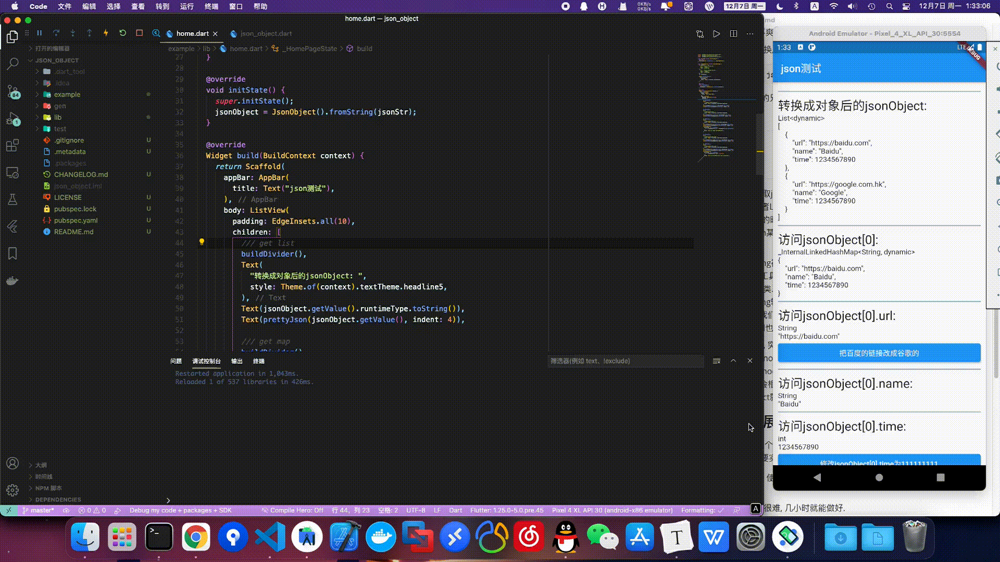

# json_object

一个可以把json字符串直接在**运行时**转换成对象的插件. 你可以直接通过value = json.key的方式访问由json内的成员变量和方法, 甚至是类. 插件灵感来自[dartwatch-JsonObject](https://github.com/chrisbu/dartwatch-JsonObject).

## 使用指南

1. 获取一个json的字符串. 这个字符串可以从任何途径获取. 为了方便起见, 我们使用事先写好的字符串:

   ```dart
   var jsonString = '''[{
     "url": "https://baidu.com",
     "name": "Baidu",
     "time": 1234567890
   },{
     "url": "https://google.com.hk",
     "name": "Google",
     "time": 1234567890
   }]''';
   ```

2. 接下来, 将该jsonString通过JsonObject转换为dynamic类型的对象:

   ```dart
   var jsonObject = JsonObject().fromString(jsonString);
   ```

3. 加入你需要访问这个json内数组的第一个元素的链接, 也就是百度的链接. 要怎么做呢?

   ```dart
   var map1 = jsonObject[0].url.getValue(); // "https://baidu.com"
   ```

   大功告成了. 简单吗? 爽不爽?

4. 假如现在要把百度的链接换成谷歌的, 我要怎么做呢?

   ```dart
   jsonObject[0].url = jsonObject[1].url.getValue();
   ```

   做过json string转object的兄弟们, 真的没觉得这样爽嘛TwT?

## 无图言卵, 上图!



## 插件背景

1. 当下直接从json string获取json object的方法: json.decode(jsonString), 这时json string会被转换为Map或者List, 可能很多人觉得这样就够了. 但是每当使用value = map['key']这样访问数据的时候, 我总是苦于Dart不能像JavaScript那样直接通过value = json.key访问json某个键的值. 为什么Map不能像JavaScript里的Map那样运作呢?
2. 要想在Dart上让json string被直接转换为json object, 现有的方案之一是使用类似json_serializable那样的工具, 通过build_runner等生成工具, 在编译代码之前自动生成每个json对应的实体类. 懒狗如我又觉得这个方法太过复杂, 有没有可能直接在代码运行时就将json string转换为某个类型的对象, 然后这个对象能实现value = json.key这样的写法呢? 我们知道这在Dart Console工程里是很简单的一件事, 我们有dart:mirrors, 但是我们也知道dart:mirrors在Flutter上被禁用了, 原因请自查. 
3. 在github上苦苦寻找思路, 突然翻到2016年的一个旧仓库[dartwatch-JsonObject](https://github.com/chrisbu/dartwatch-JsonObject). 仓库的作者借助dynamic的noSuchMethod方法, 成功的实现对dart静态代码的局部分析能力. 通过noSuchMethod透出的invocation, 个人理解上, 我们甚至可以实现动态的方法调用, 虽然工作量会相当的大, 但是只是实现一个小小的json转object还是不在话下的, 于是json_object就这么诞生了.

## 任务清单(持续拓展中)

详见CHANGELOG.md

## 应用领域构思

1. 如果有一天json和string能够自由自在的互相转换, 那么本地存储一个对象也许就不是难事了, 毕竟我们能将Dart里的object直接转化为string.
2. 现有Flutter的动态化方案里可以尝试加入部分类似的实现, 比如在[DynamicFlutter](https://github.com/Newcore-mobile/DynamicFlutter)的AstRuntime加入动态类和动态方法. 不过我相信应该有不少人已经做了, 也许是鄙人还没发现或者还没了解.

## 写在最后

感兴趣的小伙伴请务必给几个PR或者Issue反馈问题, 看一看玩一玩用一用落落地orz. 本人开发经验和水平均有限, 并不知道这种做法是否会带来不好的影响, 还请各位大哥大姐自行评判, 我始终会在这里等你.

